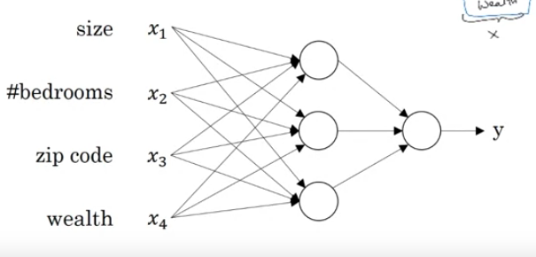
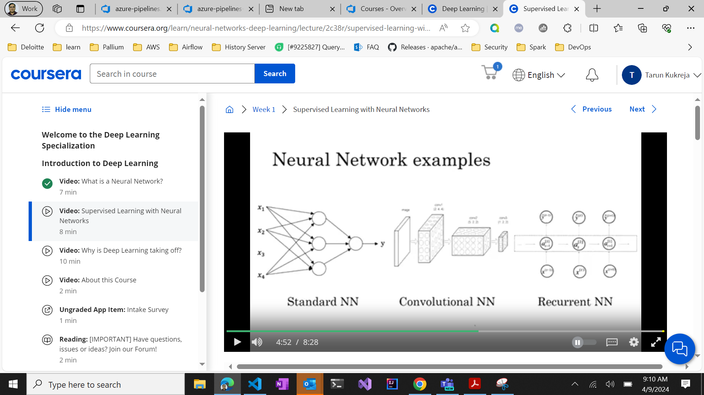

# What is Neural Network?
• DL refer to train Neural Network.
## Housing Price Prediction
Graph - Price V/S Size

Size > Neuron > Price : Single Neuron Netural Network

• ReLU - Y = 0 for some 0 < x < x1 then stright line where y increase with x in linear fashion.

Now consider other features as well -
    Size - Family Size
    Bedrooms - Family Size
    
    Zip Code (Postal Code) - Walkable/School Quality
    Wealth - School Quality

    X = Size, Bedrooms, ZipCode, Wealth
    Y = Price

    

# Supervised Learning with Neural Network
## Applications
Real Estate; Online Advertisement (User click or not) - Standard Neural Network
Photo Tagging - Convolutional Neural Network
Speech Recognization - Like Sequence Data - RNN
Translation - Also sequence data - Complex RNN - 
Autonomous Driving - Custom/Hybrid NN.

## Structured Data V/S Unstructured Data
Structured Data - Like Table
Unstructured Data - Like Audio, Image, Text

# Why is DL taking off?
• Traditional Algorithm like logistic algorithm - Its performance increase with data but after certain amount of data, its performance remain same.
• Large NN - Its performance increase with data. It perform better than any other algorithm with huge data. Now there is lots of data available.
• Initially learning process was slow.. Now there is lots of improvement. Due to Algorithm Improvement. Initially it use sigmoid function. Now using RELU function. So, gradient descent work faster.

# 