# Binary Classification
Forward Pass or Forward Propagation
Backward Pass or Backward Propagation

## Problem Statement
Input = Image
Output = Is Cat? 1 or 0.

In image, we have 3 matrix - RGB
It converted into feature vector - 1 D - first all row one by one for R then G and then B.

X = Nx * m 
m is number of observations. N is feature vector length = 64 * 64 * 3.
Y shape = (1, M) 

# Logistic Regression
Used when o/p is either 0 or 1.

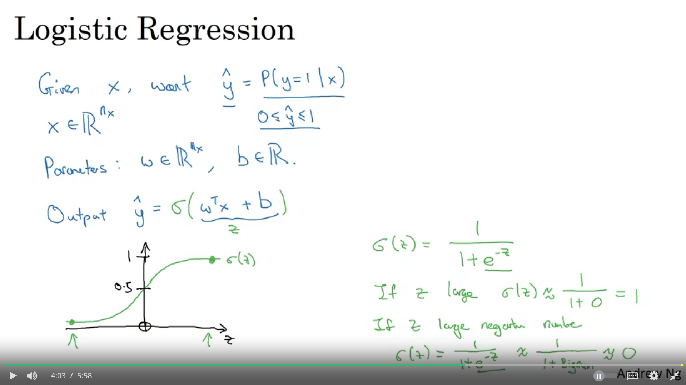

# LR Cost Function
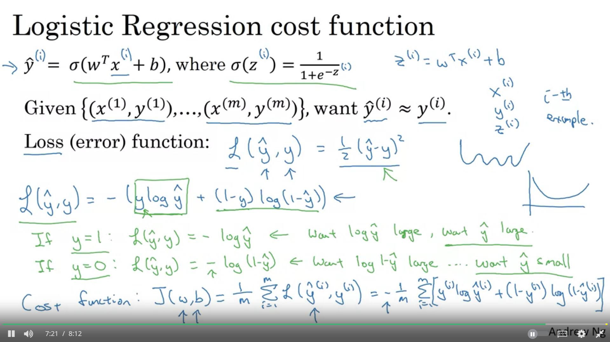

# Gradient Descent
We decide w and b initial value. 
Gradient Descent - We try to update w and b so that we can reach to lower of cost function.
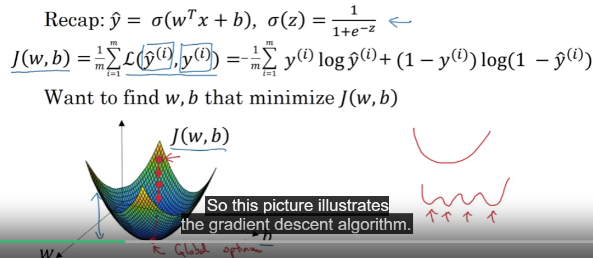

## Understand
Ignore b for now.
Derivation is slope of a function.

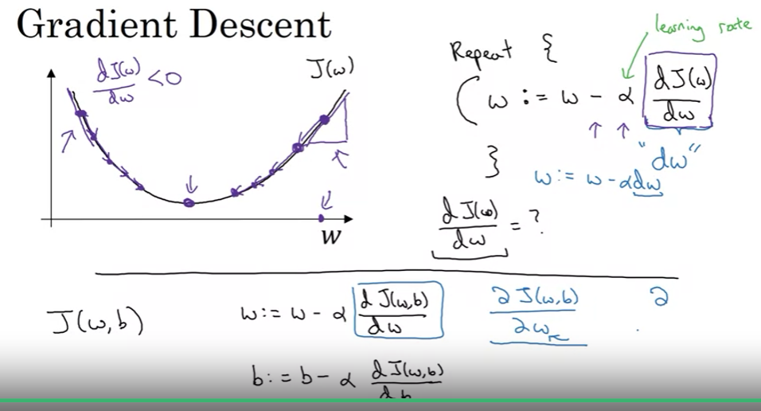

# Derivatives
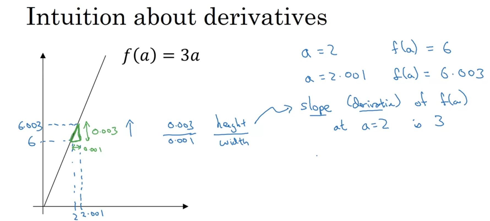

If we increase x very little then how much y increase.. f(x) = 3x
slope = derivative = 3. 

It is always 3 independent of x.

## Complex Example instead of linear.
f(x) = x^2
Derivative keep changing based on value of x.
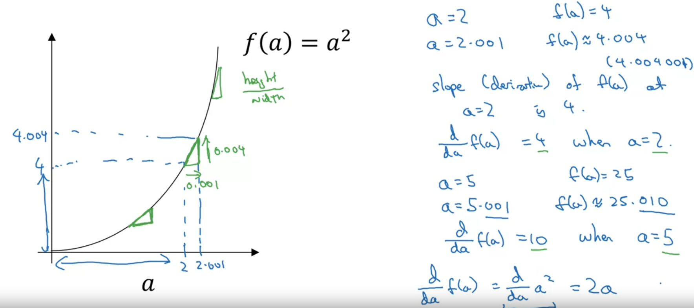

# Computation Graph
Computation of Neural Network
1. Forward Pass/Propogation to calculate the output.
2. Followed by Backward pass that use gradient descent or derivative.
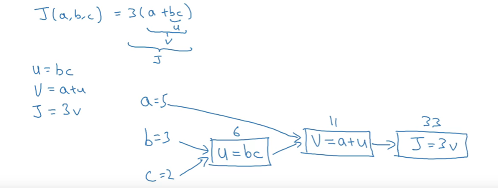

# Derivatives with Computation Graph
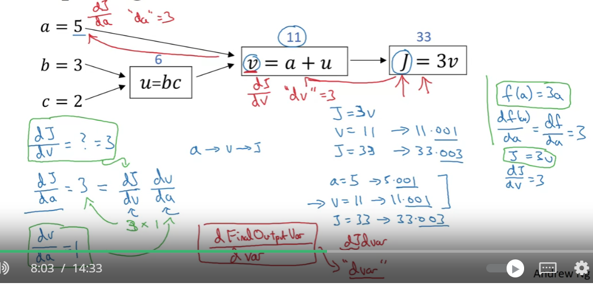
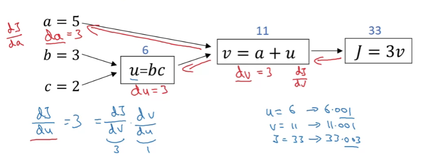
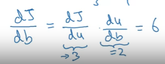

# Logistic Regression Gradient Descent
Logistic Regression
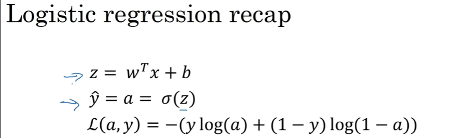
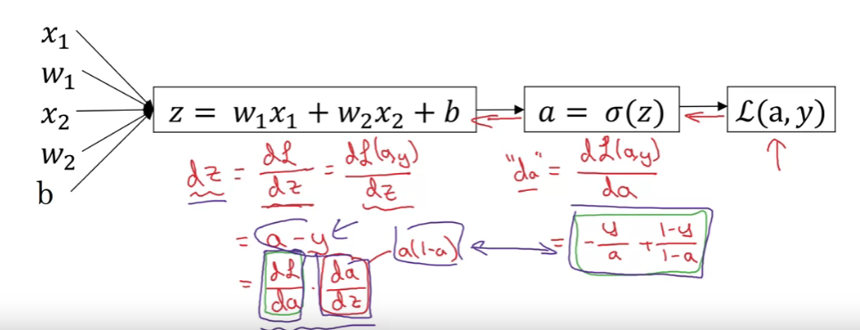

Find Derivative of Lost Function with respect to weigths and b
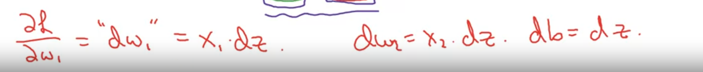

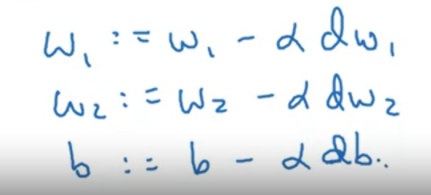

# Gradient Descent on m Examples