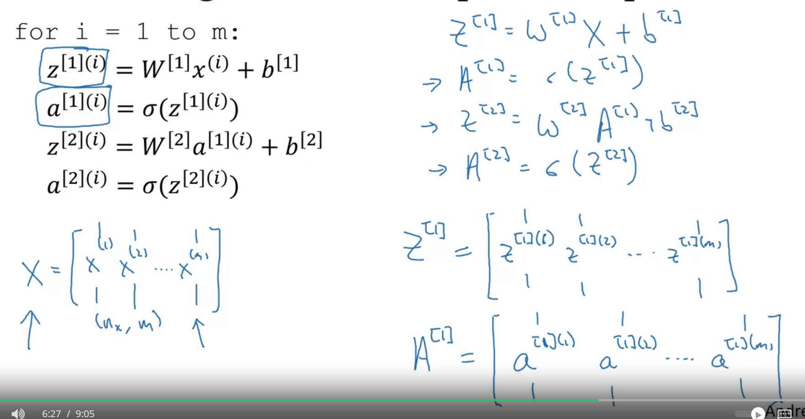

# Neural Network Overview
Superscript () - represent the sample
Superscript [] - represent the layers in neural network.

# Neural Network Representation
Single Hidden Neural Network = 2 Layer NN (We don't calculate input layer)

Input Layer > Hidden Layers > Output Layer

# Computing a Neural Network's Output

# Vectorizing Across Multiple Examples
Superscript 
    [i] = ith layer
    (i) = ith observation
Subscript
    i = ith neuron in the layer.

For m observation and 2 layers, non-vectorized and vectorized

# Explanation of Vectorized Implementation
By WX, we are getting Column vectors.
For simplicity, we are assuming b = 0

# Activation Function
z = wx + b
a = α(z)
α - sigmoid is an activation function.
We can have any other function instead of α.

0 < α < 1

Sometimes activation function is different for different layer.

Now, one of the downsides of both the sigmoid function and the tan h function is that if z is either very large or very small, then the gradient of the derivative of the slope of this function becomes very small. So if z is very large or z is very small, the slope of the function either ends up being close to zero and so this can slow down gradient descent. So one other choice that is very popular in machine learning is what's called the rectified linear unit. So the value function looks like this and the formula is a = max(0,z). So the derivative is one so long as z is positive and derivative or the slope is zero when z is negative.

Thumb Rule -
1. If one of the O/P is zero like binary classification then sigmoid for output layer.
2. For all other, rectified linear unit.

# Why do you need Non-Linear Activation Function
Sometime activation function is a = g(z) = z

If you were to use linear activation functions or we can also call them identity activation functions, then the neural network is just outputting a linear function of the input.

And we'll talk about deep networks later, neural networks with many, many layers, many hidden layers. And it turns out that if you use a linear activation function or alternatively, if you don't have an activation function, then no matter how many layers your neural network has, all it's doing is just computing a linear activation function. So you might as well not have any hidden layers.

# Derivative of Activation Function
In backward propagation, you need to find the derivative or slope of activation function.

## Sigmoid Activation Function
g(z) = 1 / (1+e^-z)
d(g(z)) = g(z)(1-g(z))

If z is very large, g(z) = 1. d(g(z)) = 0 (close to 0).
If z is very large in -ve, g(z) = 0. d(g(z)) = 0 (close to 0)
If z = 0. g(z) = 1/2. d(g(z)) = 1/4

## Tanh Activation Function
g(z) = e^z - e^-z / e^z + e^-z
d(g(z)) = 1 - g(z)^2

If z is very large, g(z) = 1. d(g(z)) = 0 (close to 0).
If z is very large in -ve, g(z) = -1. d(g(z)) = 0 (close to 0)
If z = 0. g(z) = 0. d(g(z)) = 1

## ReLU and leaky ReLU
g(z) = max(0, z)
d(g(z)) = 0 if z < 0
        = 1 if z > 0
        = undefined if z = 0

Leaky
g(z) = max(0.01z, z)
d(g(z)) = 0.01 if z < 0
        = 1 if z > 0
        = undefined if z = 0

# Gradient Descent of Neural Networks
We will learn GD with one hidden layer NN.
We take some random paramters like w, b for different layers and different neuron.
Calculate Cost Function i.e. Loss Function.

Based on that we find GD or derivatives of Lost function with respect to parameters and adjust the parameters.. - Repeat this.

## Formulas for computing derivatives
Assuming Binary Classification so we are using sigmoid for output layer.

# Backpropagation Intuition

# Random Initialization
Logistic Regression - It is ok to initialize weights with zero.
NN - If we initialize with 0 then Gradient Descent will not work.
