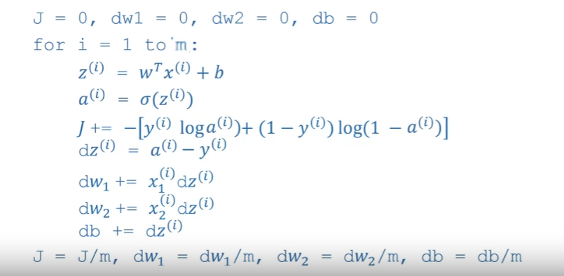
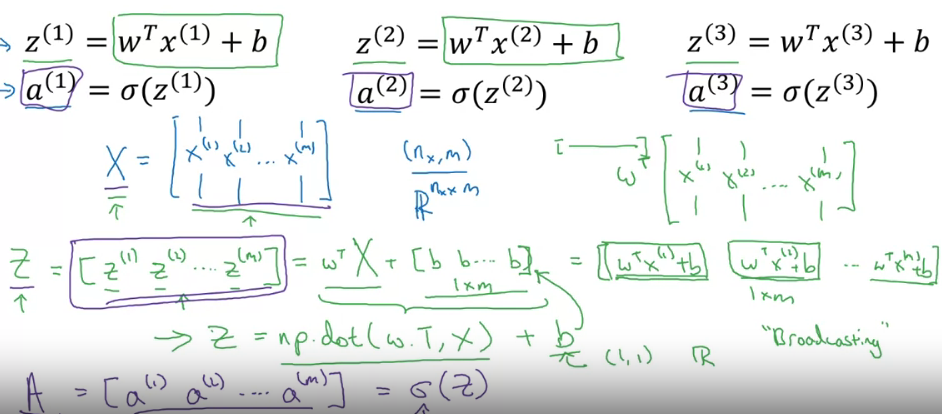
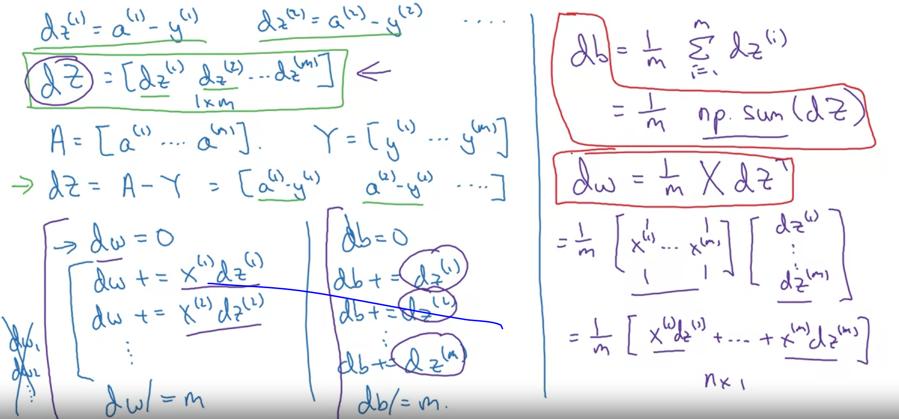
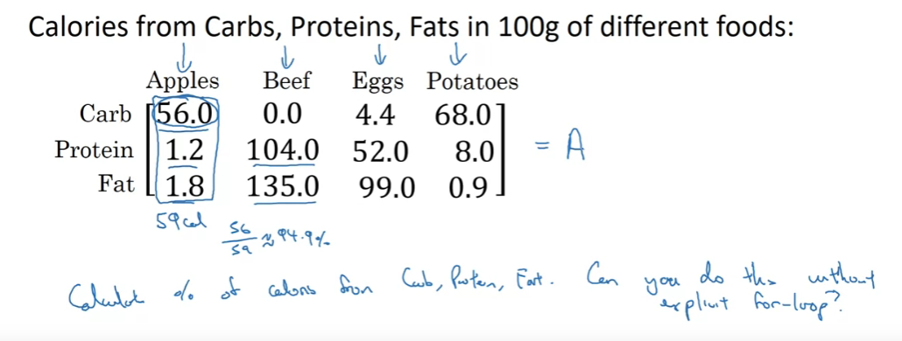
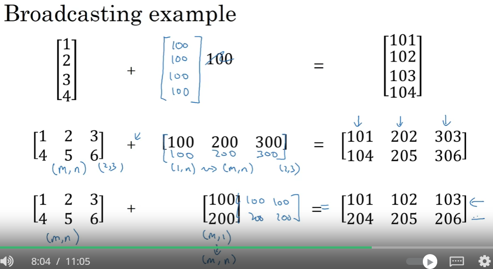
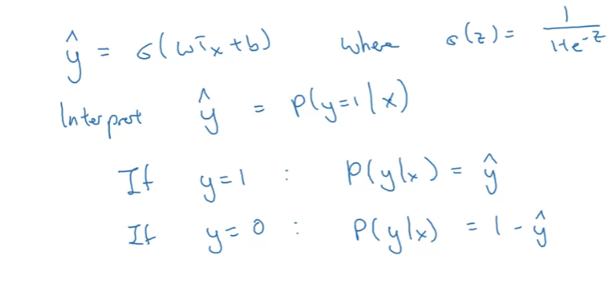
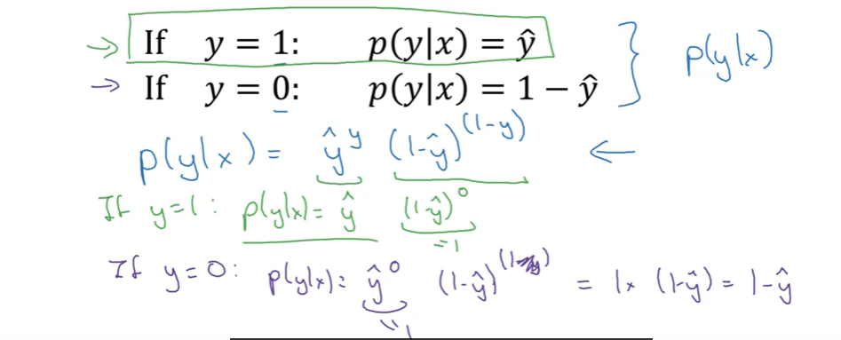
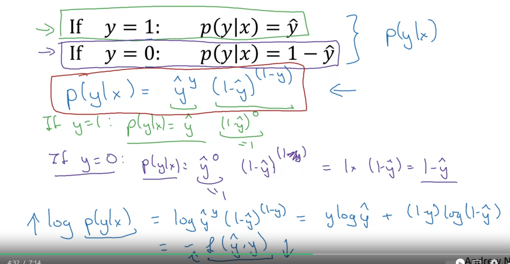

# Vectorization
Technique to remove loops. It improve performance to preferred in Deep Learning.

All CPU or GPU have SIMD - Single Instruction Multiple Data. Inbuild functions... Python take advantage of parallelism.

vectorization_demo.ipynb

# More Examples
Neural Network Guidelines
    Whevever possible, avoid explicit for-loops.

v = [v1, v2, ... vn] 
u = [e^v1, e^v2, ....]

Not Vectorization
u = np.zeros((n,1))

for i in range(n):
    u[i] = math.exp(v[i])

Vectorization
u = np.exp(v)

Logistic Regression Derivative

Here we can't remove the for loop.
But we can convert dw1 and dw2 to vector dw.

# Vectorizing Logistic Regression
n is number of features
m is number of example or sample size.

# Vectorizing Logistic Regression Gradient Output

# Broadcasting in Python
Problem Statement -

Broadcast - Python/Numpy automatcally create replica and expand array hoizontally or vertically. expansion if there is only one row or one column.

Solution - broadcast.ipynb

General Principle
(m,n) +, -, *, / (1,n) => (1,n) convert to (m,n)
(m,n) +, -, *, / (1,n) => (m,1) convert to (m,n)

# Numpy Vectors
Sometime the hidden code and broadcasting can cause error.

Trip and Tricks
1. a = np.random.randn(5) # shape (5,)
1 rank array is not a colum nor a row vector. It transpose is same.
a * a transpose != Correct value in this case.

Better a = np.random.randn(5, 1) # It create a column vector. Or (1, 5) - Create row vector.
2. Use assert
assert(a.shape == (5,1))
3. Reshape 1 rank array
a = a.reshape(5,1)

# Explain Logistic Regression Cost Function

