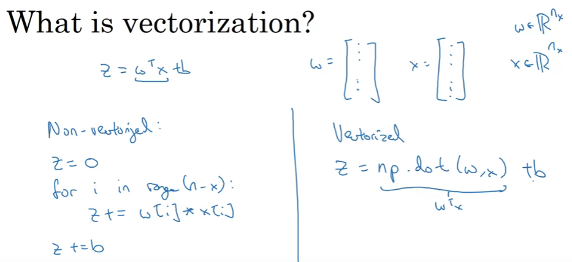

# Vectorization
Technique to remove loops. It improve performance to preferred in Deep Learning.

All CPU or GPU have SIMD - Single Instruction Multiple Data. Inbuild functions... Python take advantage of parallelism.

# More Examples
Neural Network Guidelines
    Whevever possible, avoid explicit for-loops.

# Vectorizing Logistic Regression

# Vectorizing Logistic Regression Gradient Output

# Broadcasting in Python

# Numpy Vectors

# Jupytor Notebook

# Explain Logistic Regression Cost Function