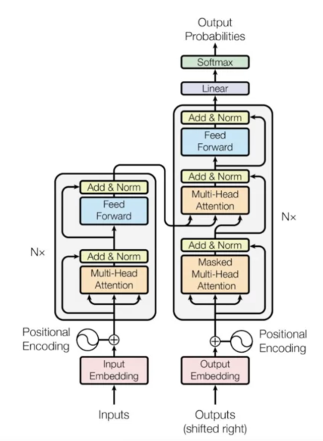
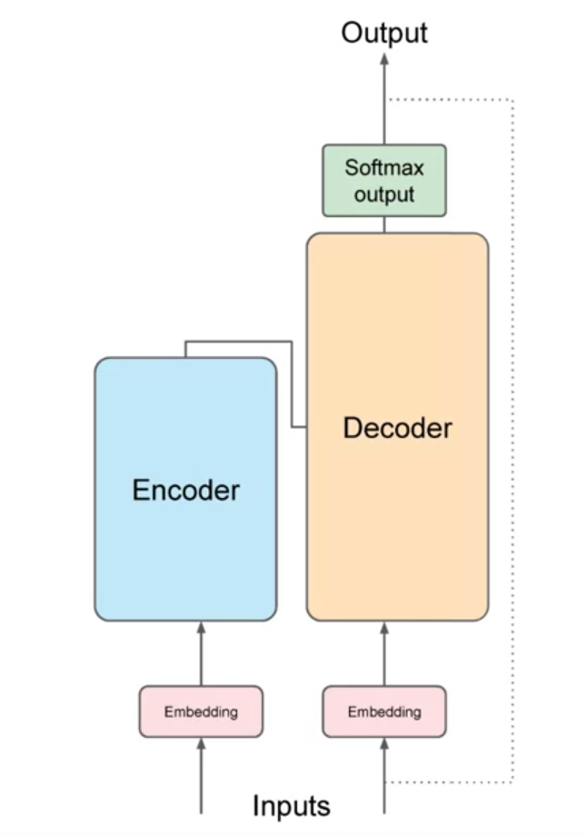

# Course Introduction
LLM and GenAI are general purpose technology
Build application with LLM.

Gen AI have many area like language, vision, image etc. But here we focus on LLM only.

# Topics Introduction
How tranformer network actual works.

# Generative AI and LLM
ChatBot is like Generative AI. Others Code Generating, Image Generating.
Gen AI generate content.
It is a subset of Traditional ML.
ML that underpin generative AI have learned these abilities by finding statistical patterns in massive datasets of content that was originally generated by humans. 

## LLM
Foundation or Base Model - BERT, GPT, BLOOM, PaLM, LLaMa, FLAN-T5
Large language models have been trained on trillions of words.
Foundation models with billions of parameters exhibits emergent properties beyond language alone.
More parameters means more better.

Use the base model as it is or fine tune these models.

Text pass to LLM is known as Prompt. LLM Model predict the next word(s). Model generate Output known as Completion.

# Community
https://community.deeplearning.ai/

# LLM Use case and tasks
Technique - Predicting next word.
LLM Chatbot; Essay Writer; Summarize Conversation; Translation Task; Generate Code; Information Retrieval; Augumented LLM - connect with external data sources or api.

# Text Generation Before Transformers
Past LLM Model use RNN or Recurrent NN. 
Lots of compute power needed.
With limited resource, it check for last word to predict one word.
If we increase resource, then it check for few words only... which may fail
    E.g. "The milk is bad, my tea tastes 'great'."

Actual Gen AI tool should have understanding of whole sentence or some time the complete document.

Understanding language can be challenge - Same word meaning differently. So, to know the word meaning, we should know the context.

2017 Paper - "Attention is all you need" From Google, University of Toronto.
    Scale efficiently.
    Parallel Process
    Attention to input meaning.

# Transformer Architecture
Learn the relevance and context of all the words.
Self attention
    Each word with every other word.

## Transformer

Simplify 

Two main part - encoder and decoder. Both work in partnership.
ML is big statistical calculator.

It work with number not word. So, first we need to tokenize the words.
    Like each number represent the word position in a dictionary.
    First select approach of tokenize.

Input pass to Embedding Layer. It is a trainable vector embedding space. In this space, token is a vector which have a unique location within space.

Each vector try to learn the context. 
Vector dimension in N-Dimension.
2 vectors fall in one zone are related one. Distance between them is calculate with angle between them.

Positional Encoding - You add positional encoding to word vector. So, it is like position of word within sentence.

Now this vector (token vector + Positional encoding) to self-attention layer. It build contextual dependencies between words. Self-attention weights are learn during training. Weight reflect the importance of each word.

Transformer architecture have multi-headed self-attention. Number of head 12-100 commonly. It learn in ||.
    Different head focus on different things or aspects of language like relationship between entities; Activity of sentence; Word Ryhme.

Decoder - Token to probability.
Softmax Output - A probability score for each word. One single token will have higher probability then rest.

# Generating Text with Transformer
Example - Translate french to english.
Above process, it generate one token that will be input for next cycle.
This continue until model predict end of sequence token.

Encoder - Encode input ("prompt") with contextual understanding and produce one vector per intput token.

Decoder - Accept input tokens and generate new tokens.

## Transformer Types
Classification Task - Encoder Model Only - E.g. sentiment analysis. I/P and O/P length is same.
BERT is example of encoder model only.

Encoder Decoder Model - Translation. I/P and O/P length is different.
BART and T5

Decoder Only Model - Generalized Tasks. - GPT, BLOOM, LLaMa

# Tranformer - Attention is all you need
https://arxiv.org/abs/1706.03762

"Attention is All You Need" is a research paper published in 2017 by Google researchers, which introduced the Transformer model, a novel architecture that revolutionized the field of natural language processing (NLP) and became the basis for the LLMs we  now know - such as GPT, PaLM and others. The paper proposes a neural network architecture that replaces traditional recurrent neural networks (RNNs) and convolutional neural networks (CNNs) with an entirely attention-based mechanism. 

The Transformer model uses self-attention to compute representations of input sequences, which allows it to capture long-term dependencies and parallelize computation effectively. The authors demonstrate that their model achieves state-of-the-art performance on several machine translation tasks and outperforms previous models that rely on RNNs or CNNs.

The Transformer architecture consists of an encoder and a decoder, each of which is composed of several layers. Each layer consists of two sub-layers: a multi-head self-attention mechanism and a feed-forward neural network. The multi-head self-attention mechanism allows the model to attend to different parts of the input sequence, while the feed-forward network applies a point-wise fully connected layer to each position separately and identically. 

The Transformer model also uses residual connections and layer normalization to facilitate training and prevent overfitting. In addition, the authors introduce a positional encoding scheme that encodes the position of each token in the input sequence, enabling the model to capture the order of the sequence without the need for recurrent or convolutional operations.

# Prompting and Prompt Engineering
Text feed into model is Prompt.
Act of generating text is known as inference.
Output text is known as Completion.

Full amount of text or memory available to use for prompt is called the context window.

Best approach is to include an example of the task the model to carry out inside the prompt. - It is called in-context learning.

# Generative Configuration

# Generative AI Project Lifecycle

# Guideline before starting the labs

# Labs walkthrough

# 
