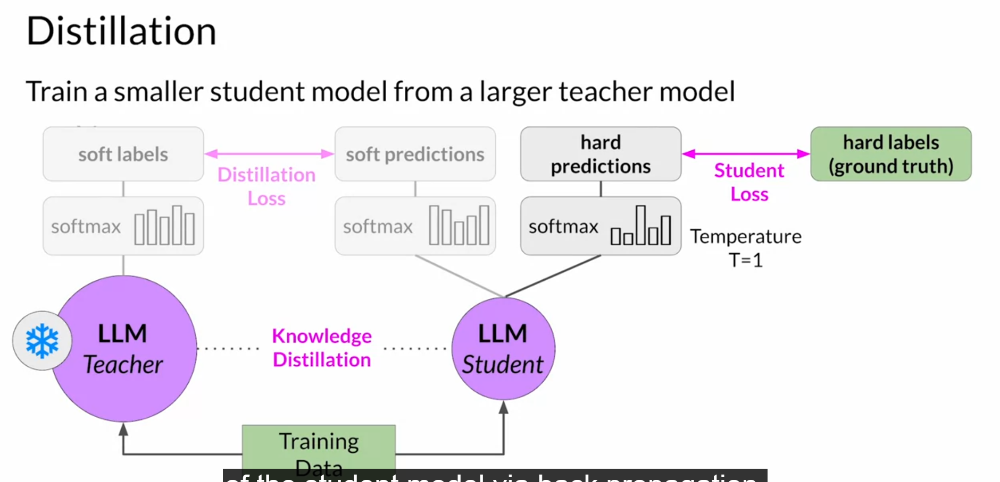
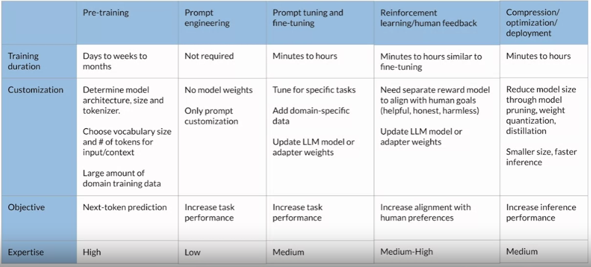

# Model Optimization for Deployment
Generative AI Lifecycle last stage - Application Integration
    Optimize and Deploy Model for Inference
    Augument Model and build LLM Powered Applications.

## Model Optimization to improve application performance
Objective - Reduce latency and storage requirement.

Reduce Size of LLM while maintaining model performance

## LLM Optimization Techniques
Distillation - LLM Teacher > LLM Student
    Student model will learn statistically mimic the behavior of teacher model.
    Reduce Distillation Loss - Difference between result by teacher and student.
    Also try to find the Student Loss - Different between actual result and student.
    Combine both for back propagation of student model.
    
    It is not effective for decoder. It is mainly effective for encoder only.
Quantization - Transfer weights to lower precision representation.
    Actual reduce size of LLM.
Prunning - Remove redundant model/parameters that have little impact.
    Remove model weights with value close or equal to zero.
    Methods -
        Full Model Re-training
        PEFT/LoRA
        Post Training

# Generative AI Project Lifecycle Cheat Sheet

# Using LLM in Applications
## Problems
Knowledge Cut-off - Out of Date - Sometime data is older. ChatGPT 3 will not have data for 2024. It can't tell India Prime Minister.
Wrong Mathematical Result - LLM doesn't do calculation. It's answer may be close but no always correct.
Hallucination - It generate answer even if it doesn't know answer.

This problem can be overcome with connecting LLM with external data source.
## LLM Powered Application
UI (User can enter prompt and see result) > Orchestration Library > LLM
                                                                  > External Data Source and APIs.

### RAG - Retrieval Augmented Generation
It help to connect model with external Data Sources to overcome its issues.
One way is retrain on latest data. But it is expensive.

But RAG, we provide access to document that were not avilable for training.. or some internal office documentation.

It is framework that allow LLM to see new data.

Facebook 2020.

Model component - Retriever = Query Encoder + External Information Source.
    External Source is Vector Datastore.
    Query Encoder > find the best suited document for a query.
    So, new prompt will have query prompt + Best suited Document from Vector Store.  > LLM > LLM generate response.

External System - Document; Wiki; Expert System; Web Pages; Database; vector store.

It search based on similarity.

Two considerations for using external data in RAG:
    Data must fit inside context window.
    Data must be in format that allow its relevance to be accessed at inference time: Embedding Vectors.

Prompt text converted to embedding vectors.

# Interacting with External Application
Kind of augumenation to LLM

Call API etc.

Plan Actions > Format Output > Validate Action

# Helping LLMs reasons and plan with Chain-of-Thoughts
It is important that LLMs can reason through the steps that an application must take, to satisfy a user request.
Some tasks can be challenging for LLM like problem involve multiple steps or mathematics.

LLM is bad in reasoning tasks. I have 12 pen, I purchase 2 box each have 10 pen so total pens?

## Human take step by step approach to solve the complex problems
First I have 12 pens
2 box each have 10. So, pen 20
total = 32

All this steps are reasoning steps that human can take. Or Chain of Thoughts.

Asking the model to mimic this chain of thoughts is called "Chain of thoughts Prompting"

## Chain of Thoughts Prompting can help LLM
Prompt -
Q: Roger has 5 tennis balls. He buys 2 more cane of tennis balls. Each can has 3 tennis balls. how many tennis balls does he have now?
A: Roger started with 5 tennis balls. 2 cans of 3 tennis balls is 6 tennis balls. 5 + 6 = 11. The anser is 11.

Q: Cafeteria had 23 apples. If they used 20 apples to make lunch and brought 6 more. How many apples do they have?

Completion -
The cafeteria had 23 apples. They used 20. They had 23-20=3. They brought 6 more apples.so they have 3 + 6 =9. The answer is 9.

Similar way we can share thought in other area like Physics. Will sink or not?

# Program-aided Language Model
## LLM can struggle with Mathematics
What is 40366/439? - 92.549. It is wrong. Reason - LLM don't do math calculation.
It can be solve if we allow our model to connect with external system that are good in math.

Program-aided language model is framework to augument the LLM.

LLM + Code Interpreter // Python code interpreter can do math.

LLM generate output with Interpreter code. This code can solve specific problem.

Prompt contain reasoning in this way.
// - Actual it is # Roger started with 5 tennis ball - It will be skipped by Python
tennis_ball = 5 // Code Statement in Pink.

## PAL models
question > PAL template question > PAL formatted prompt/solution > LLM > Python Script > Python Interpreter > Answer

## PAL Architecture
Orchestrator Library help us to automate the complete process.

                     LLM 
                      ^
                      |                          
                      V
User (UI)  <-->  Orchestrate Library <--> Python Interpreter

# ReAct: Combining Reason and Action
Frameword called ReAct. It help LLMs to plan out and execute these workflow.

## ReAct: Synergizing Reasoning and Action in LLM
It is prompting strategy that combine chain of thoughts reasoning with action planning.

LLM + Websearch API

ReAct uses structured examples to show a large language model how to reason through a problem and decide on actions to take that move it closer to a solution. The example prompts start with a question that will require multiple steps to answer.

Question + Thoughts + Action + Observation

E.g. - 'Which magazine was first started - Arthur's magzine or First for Women?

Thoughts - A reasoning step that identifies how model will tackle the problem and identify the action to take.
    "I need to search Arthur's magzine and First of Women and find which one was started first"

Action - An external task that the model can carry out from an allowed set of actions.
  search [entity] lookup [string] finish [answer] // API to seach in wiki

  search["Arthur's magazine"]

Observation - The result of carrying out the action
"Arthur's magazine (1844-1846) was an american literacy periodic published in ...."

Model can repeat the cycle many times.

Thought2 - 'Arthur's magazine started in 1844. I need to search for First of Women"
Action2 -   search["First of Women"]
Observatiob 2 - "First of women ..... The magazine started in 1989..."

Thought3 - "First of women was started in 1989. 1984 (Arthur's Magazine) < 1989 (First for Women). so, Arthur's Magazine as started first.
Action 3- finish[Arthur's Magazine]
It end cycle and return output.

## Building Up React Prompt
Here we mention 1st example and then ask question.

## LangChain
LangChain is Orchestrate Library
    Prompt Template
    Memory that can be used to store interaction with LLM.
    Tools - calls to external data store; various API
    Agents - for PAL and React

# ReAct: Reasoning and Action
https://arxiv.org/abs/2210.03629
While LLMs have excelled in language understanding and decision making, the combination of reasoning and acting has been neglected. ReAct enables LLMs to generate reasoning traces and task-specific actions, leveraging the synergy between them. 

# LLM Application Architecture

                Consumers - Users and System
-----------------------------------------------------------------------------
| Application Interfaces e.g. Website, Mobile Application, API etc.         |
-----------------------------------------------------------------------------
| LLM Tools & Framwork: e.g. LangChain, Model Hubs                          |
-----------------------------------------------------------------------------
| Information Source   |   LLM Models     |    Generated O/P & Feedback     |
| Document;Web;DB      |   Optimized LLM  |                                 | 
-----------------------------------------------------------------------------
| Infrastructure e.g. Training/Fine Tuning, Serving, Application Components |
-----------------------------------------------------------------------------

# AWS Sagemaker Jump Start
Sagemaker is Model Hub. 
It help to deploy foundation model.
Fine Tune and many more

Just use cost monitoring and optimizing practices.

AWS > Sagemaker Studio > JumpStart
    Choose base model > Fine Tune > Deploy

Flan-T5 Base > Choose instance type; Security Settings > Deploy - It give an API.
                                                      > Fine Tune where you specify the source data. (> Hyper parameters)
                                                      
                                                    > Run Notebook - Use model in notebook

# Links
Generative AI on AWS: Building Context-Aware Multimodal Reasoning Applications

https://arxiv.org/pdf/2203.02155
https://arxiv.org/pdf/2009.01325
https://arxiv.org/pdf/1707.06347
https://arxiv.org/pdf/2305.18290
https://arxiv.org/pdf/2212.08073
https://arxiv.org/pdf/2201.11903
https://arxiv.org/abs/2211.10435
https://arxiv.org/abs/2210.03629
https://github.com/langchain-ai/langchain
https://a16z.com/who-owns-the-generative-ai-platform/