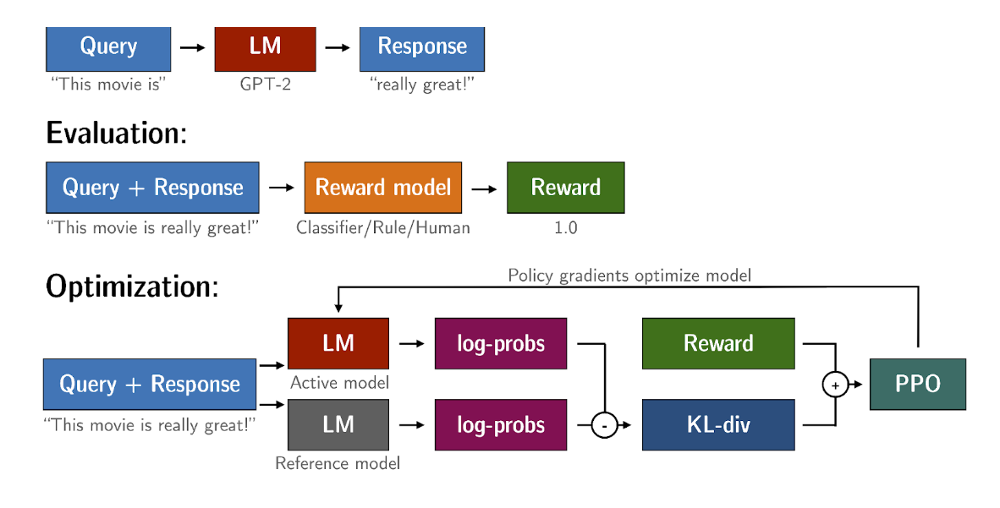

# Introduction
It help to take care of harmful content.

Responsible AI.

# Aligning Model with Human Values
GenAI Project Lifecycle - Adapt and align model - Align with Human Feedback.

## Model Behaving Badly
Toxic Language
Aggresive Responses
Providing Dangerous Information

Not helpful; Not Honest; Dangerous Information like how to hack wife wifi.

# Reinforcement learning from Human feedback
Once performance check for summary generation -
No Fine Tunning < Initial Fine Tuning < Fine Tune with Human Feedback.

It help to maximize usefulness and relevance.
Minimize Harm
Avoid Dangerous Topics

## Reinforcement Learning
"Agent" try to learn by taking actions in an "Environment".
Objective - Maximize rewards received for actions.

Agent take continuous action in Environment.
State change for environment.
Agent get reward from environment for the action. (or penalities)

Agent keep learning

### Tic-Tac-Toe
Agent objective is to win the game.
Environment is 3*3 game board.

This is iterative learning process. Try and Error approach.

First agent take random action.
It find the list of actions that cause maximum awards.

## Reinforcement Learning: Fine Tuning
Agent Policy is LLM. It decide the agent actions.
    Objective: Generate aligned text. {helpful, accurate, no harm}
Environment is Context window of the model.

Action Space - Token Vocabulary
Action that model/agent take which token it choose next.

Reward Determing is more complex than Tic-Tac-Toe
    One way is some human evaluate based on some matrices.

Getting Human Feedback is long process.
Alternative, Use an additional model i.e. reward model that classify the output of LLM and alignement with human segment.

# RLHF: Obtaining feedback from Human
## Prepare dataset for human feedback
Prompt Dataset prepare for fine tuning.

## Collect Human Feedback
Define your model alignment criterion.
For the prompt-response set that you just generated, obtain human feedback through labeler workforce.
Also, we ask muliple labelers to label the different completion responses. (Don't trust one.)

## Prepare labeled data for training
Convert ranking into pairwise training data for the reward model.
[pi, pj] for all i,j [1, 0] or [0, 1]. First is correct is pi is better else 2nd.

So, we choose Pj for which [Pj, Pk] = [1,0] for all k.

# RLHF: Reward Model
Now we trained reward model with superwised training to share the rewards based on prompt and completion.
We can use it for binary classifier - Hate or Not Hate.

# RLHF: Fine Tuning with Reinforcement Learning
Now we are already using model which is good performer.

Prompt Dataset > Instruct LLM > Completion
Prompt + Completion > Reward Model > Reward value.

Reward Value > RL Algorithm > Update weights of LLM.

Popular choice for RL Algorithm is PPO - Proximal Policy Optimization.

# Proximal Policy Optimization
## PPO - Proximal Policy Optimization
Algorithm to solve Reinforcement Learning Problem. It aligned policy to more with Human prefernce.
PPO update LLM. These update are small and within a bounded region.
So, new updated LLM is close to original LLM.
Stable learning due to small changes.

## Cycle of PPO have 2 phases
Phase 1 - Create comletions
    Experiment is done with model. 
    Allow LLM to generate Completion
    Calculate rewards and value loss
Phase 2 - Model Update
    Make small changes in model.
    Evaluate these changes impact.
    Calculate policy loss.
    calculate entropy loss

    L(PPO) = L(Policy) + c1*L(VF) + c2*L(ENT)
        VF = Value Loss

## Calculate Rewards
Prompt Completion > Reward Model

Value Loss
    Estimate Future Total Reward at state S0
    Known Future Total Reward 
    Based on this 2 values, we calculate value loss.

# RLHF: Reward Hacking
Problem with RLHF could be "Reward Hacking". Here agent cheats and take action that cause maximum reward but nothing related to objective.

E.g. You have trained based on toxic reward model.
Prompt: "This product is..."
Most awesome, most incredible... But actual product is worst.

## Avoid Hacking
LLM Model - Reference Model - Weights are fridze.
LLM Model Updated through RL

Both o/p is feed to KL Divergence Shift Penality. It compare probability distribution
    it is compute extensive process.
This will penalize RL updated model if it shift too much.

So, the result of KL + Reward Model is go to PPO to update RL Updated LLM to update weight further.

This is actual part of RLHF process.

# KL Divergence
https://huggingface.co/blog/trl-peft

KL-Divergence, or Kullback-Leibler Divergence, is a concept often encountered in the field of reinforcement learning, particularly when using the Proximal Policy Optimization (PPO) algorithm. It is a mathematical measure of the difference between two probability distributions, which helps us understand how one distribution differs from another. In the context of PPO, KL-Divergence plays a crucial role in guiding the optimization process to ensure that the updated policy does not deviate too much from the original policy.

In PPO, the goal is to find an improved policy for an agent by iteratively updating its parameters based on the rewards received from interacting with the environment. However, updating the policy too aggressively can lead to unstable learning or drastic policy changes. To address this, PPO introduces a constraint that limits the extent of policy updates. This constraint is enforced by using KL-Divergence.

To understand how KL-Divergence works, imagine we have two probability distributions: the distribution of the original LLM, and a new proposed distribution of an RL-updated LLM. KL-Divergence measures the average amount of information gained when we use the original policy to encode samples from the new proposed policy. By minimizing the KL-Divergence between the two distributions, PPO ensures that the updated policy stays close to the original policy, preventing drastic changes that may negatively impact the learning process.

A library that you can use to train transformer language models with reinforcement learning, using techniques such as PPO, is TRL (Transformer Reinforcement Learning). In 
this link
 you can read more about this library, and its integration with PEFT (Parameter-Efficient Fine-Tuning) methods, such as LoRA (Low-Rank Adaption). The image shows an overview of the PPO training setup in TRL.

# Scaling Human Feedback
RLHF - To train the Reward Model, we needs lot of human effort.
Research is going on this area.
Model Self-supervision: Consistutional AI
    It use set of rules and principles to govern the model.

## Constitutional AI
It have 2 phases-
Supervised Learning Phase
    Helpful LLM > Red Teaming > Response, Critique and Revision > Fine Tunned LLM
    Red Teaming - Generate harmful response.
    Then Model criticize its own response based on rules/principles.
Reforcement Learning with AI Feedback - RLAIF