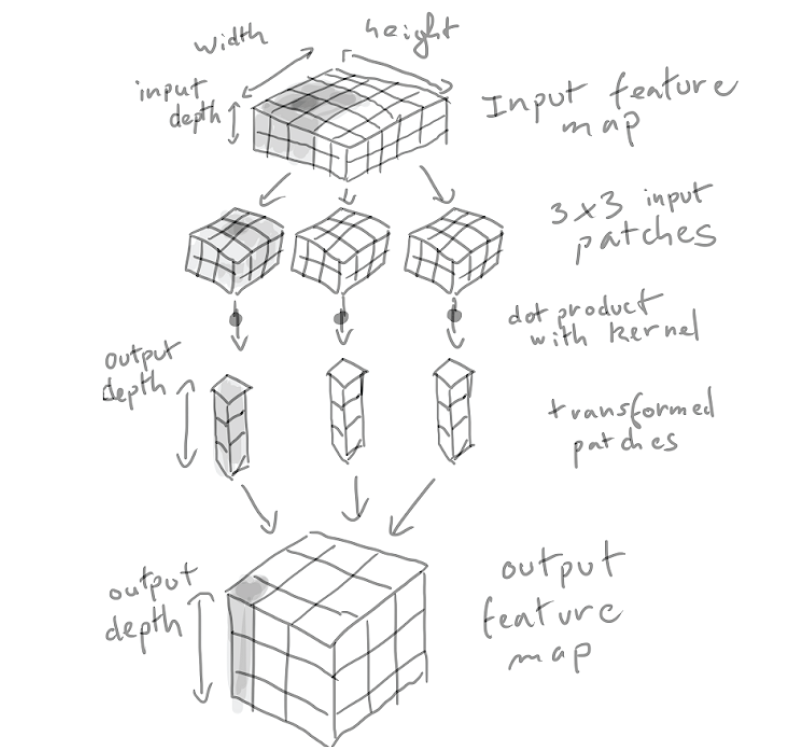

# Deep Learning for Computer Vision
Convolutional Neural Network or convnets - Used for Computer Vision Applications.

# Introduction to convnets
from keras import models
from keras import layers

model = models.Sequential()
model.add(layers.Conv2D(32, (3,3), activation='relu', input_shape={28*28*1})) // (img_height, img_weidth, image_channels)
model.add(layers.MaxPooling2D((2,2)))
model.add(layers.Conv2D(64, (3,3), activation='relu'))
model.add(layers.MaxPooling2D((2,2)))
model.add(layers.Conv2D(64, (3,3), activation='relu'))

Conv2D and MaxPooling2D are 3D Tensor of shape (height, widht, channels)
Width and Height tend to shrink as we go deeper in network.
Number of channel controlled by first parameter i.e 32.

Next step to feed output of last step to Densely connected classifier network. It take 1D but output of last layer is 3D. Flatten() 3D to 1D

model.add(layers.Flatten())
model.add(layers,.Dense(64, activation="relu"))
model.add(layers,.Dense(10, activation="softmax")) // 10 Way classification.

Layer            (type)          Output Shape         Param #
================================================================
conv2d_1         (Conv2D)        (None, 26, 26, 32)   320
________________________________________________________________
maxpooling2d_1   (MaxPooling2D)  (None, 13, 13, 32)   0
________________________________________________________________
conv2d_2         (Conv2D)        (None, 11, 11, 64)   18496
________________________________________________________________
maxpooling2d_2   (MaxPooling2D)  (None, 5, 5, 64)     0
________________________________________________________________
conv2d_3         (Conv2D)        (None, 3, 3, 64)     36928
________________________________________________________________
flatten_1        (Flatten)       (None, 576)          0
________________________________________________________________
dense_1          (Dense)         (None, 64)           36928
________________________________________________________________
dense_2          (Dense)         (None, 10)           650
================================================================

## Convolution Operation
Difference between a Densly connected layer and convolutional layer:
    Dense layer learn global pattern in this input feature space - MINT Digit; pattern involve all pixels.
    Convolution layer learn local pattern - in case of image, pattern found in small 2D window of input. e.g. edge, texture etc.

Key Characterstics
    Pattern they learn are translation-invariant i.e. after learning a pattern in bottom right corner, a convnet can identify it anywhere in image.
    They can learn spatial hierarchies of patterns. edges > local objects like eye etc > cat.

Convolution operate over 3D tensors, called feature map with 2 spatial axes - height and width. Depth axis called Channels. 
    RGB Image channels dimension would be 3.
    Black/White have 1D for channel.
Convolution operation extract patches from its input feature map and applies some transformation to all those patches, produce an output feature map.
    Output layer depth doesn't stand for color now. It stand for filter now. Filter encode specific aspects of the input data. Example: A filter could encode the concept "presence of a face in the input".

(28*28*1) > Conv2D > (26*26*32) - Means we computed 32 filters over its inputs. Each 32 channels contain 26*26 GRID of values which is response map of filter over the input

Convolution are defined by 2 Key parameters:
    size of patches - 3*3 in our example.
    depth of output feature map - number of filter computed by the convolution. 32 and then 64 and 64.

A convolution work by sliding these windows of size 3*3 or 5*5 over the 3D Input feature map, stopping at every possible location. Extract 3D Patch  of surrounding features. Now this extracted patch is transformed (via a tensor product with a same learned weight matrix called convolution kernel) into 1D vector of shape (Output Depth)

Height and Width Differ -
    Border Effect
    Strides

### Border Effect & Padding
Suppose 5*5 feature map. It has 9 different tiles with 3*3. So, output will be 9 i.e. 3*3 output feature map.
28*28 becomes 26*26 => Reduce only dimension by 2 in both.

You can use padding if want output map of same size. It means adding appropriate rows and columns in corners.
    3*3 - one column on the right, one column on the left, one row at the top, one row at the bottom
    5*5 - 2

### Convolution Stride
?
Using stride 2 means - downsize by factor 2. 
It is used rarely in practice. 

## Max Pooling Operation
Size of feature maps get half. 26*26 > MaxPooling2D > 13*13
It aggressively downsample the feature map.

It extract a window from the input feature maps and output the maximum value of each channels.

It doesn't learn. It use fix max tensor operation.
### Why downsize?
Parameters count will be huge.
? - To induce spatial filter hierarchies by making successive convolution layers look at increasingly large windows (in terms of the fraction of the original input they cover).
### Another Operation
Average Value instead of Max.
But Max perform well. Why - ?

# Training a convnet from scratch on a small data set
data augmentation - a powerful technique for mitigating overfitting in computer vision.

# Using a pre-trained convnet

# Visualizing what convnets learn